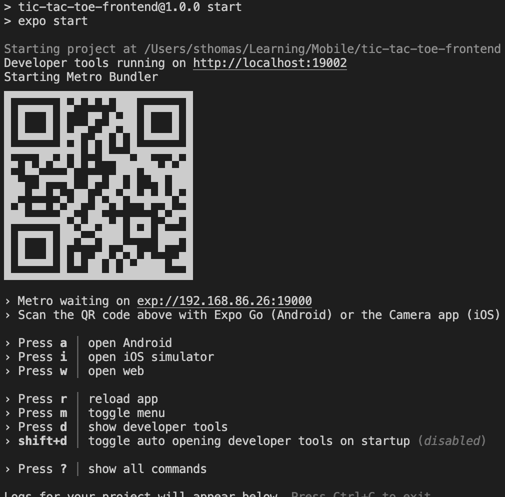

# TIC-TAC-TOE

<!-- ABOUT THE PROJECT -->
## About The Project

A tic-tac-toe application that uses expo, type script, react native for the front end. It is to be paired with the tic-tac-toe-backend repo located at:
```
https://github.com/sethpthomas91/tic-tac-toe-backend/
```

<p align="right">(<a href="#top">back to top</a>)</p>

<!-- BUILD STATUS -->
## Current Build Status

[](https://github.com/sethpthomas91/tic-tac-toe-frontend/actions/workflows/main.yml)

<p align="right">(<a href="#top">back to top</a>)</p>


<!-- Built With -->
### Built With

* [Expo](https://expo.dev/)
* [Pheonix](https://www.phoenixframework.org/)
* [Elixir](https://elixir-lang.org/)
* [TypeScript](https://www.typescriptlang.org/)
* [PostgreSQL](https://www.postgresql.org/)

<p align="right">(<a href="#top">back to top</a>)</p>


<!-- GETTING STARTED -->
## Getting Started


### Prerequisites

In order to run this project you will need to install Elixir, TypeScript, and PostgreSQL.

### Installation

1 Clone the repo
   ```sh
git clone git@github.com:sethpthomas91/android-tic-tac-toe.git
   ```

2 Navigate to the new directory
   ```sh
cd android-tic-tac-toe/
   ```

3 Install the dependencies
   ```sh
npm install
   ```

<p align="right">(<a href="#top">back to top</a>)</p>

### Running the application

1 Navigate to the project directory. It should have the app.json file in it.
   ```sh
cd android-tic-tac-toe/
   ```

2 Start the application
   ```sh
npm start
   ```

   Your terminal should look like this:
   

3 ANDROID Steps

Download ExpoGo from the play store. Scan the barcode that is generated once you have run the prior step.

4 OIS Steps

Open your camera application and scan the barcode that is generated once you have run the proir step.

<p align="right">(<a href="#top">back to top</a>)</p>

### Testing

1 Navigate to the root directory and run
   ```sh
npm test
   ```
<p align="right">(<a href="#top">back to top</a>)</p>

## Reflections


<!-- ACKNOWLEDGMENTS -->
## Contributors

* [sethpthomas91](https://github.com/sethpthomas91)

<p align="right">(<a href="#top">back to top</a>)</p>


<!-- MARKDOWN LINKS & IMAGES -->
<!-- https://www.markdownguide.org/basic-syntax/#reference-style-links -->
[contributors-shield]: https://img.shields.io/github/contributors/github_username/repo_name.svg?style=for-the-badge
[contributors-url]: https://github.com/github_username/repo_name/graphs/contributors
[forks-shield]: https://img.shields.io/github/forks/github_username/repo_name.svg?style=for-the-badge
[forks-url]: https://github.com/github_username/repo_name/network/members
[stars-shield]: https://img.shields.io/github/stars/github_username/repo_name.svg?style=for-the-badge
[stars-url]: https://github.com/github_username/repo_name/stargazers
[issues-shield]: https://img.shields.io/github/issues/github_username/repo_name.svg?style=for-the-badge
[issues-url]: https://github.com/github_username/repo_name/issues
[license-shield]: https://img.shields.io/github/license/github_username/repo_name.svg?style=for-the-badge
[license-url]: https://github.com/github_username/repo_name/blob/master/LICENSE.txt
[linkedin-shield]: https://img.shields.io/badge/-LinkedIn-black.svg?style=for-the-badge&logo=linkedin&colorB=555
[linkedin-url]: https://linkedin.com/in/linkedin_username
[product-screenshot]: images/screenshot.png